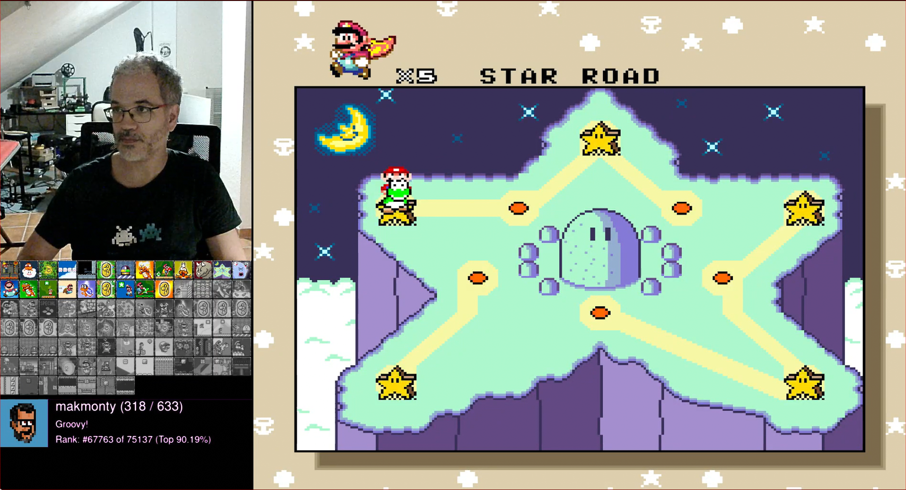
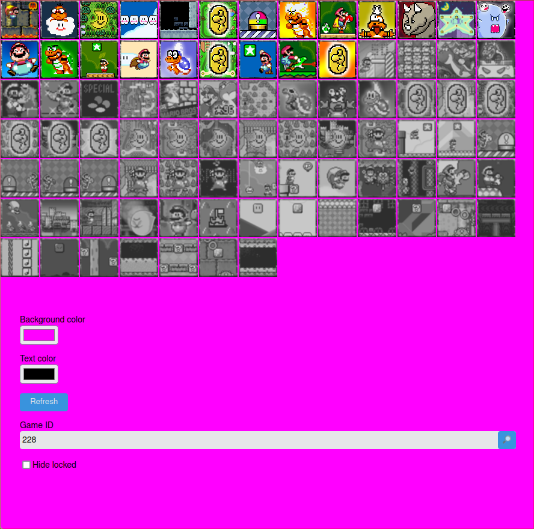
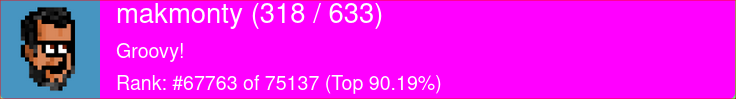

# Cheevos overlay collection

A collection of overlays to be used on your [Retroachievements](https://retroachievements.org/) streams.



## Available overlays

* [Game progress](https://overlays.makmonty.com/overlay/game-progress)
* [User profile](https://overlays.makmonty.com/overlay/user-profile)

### Disclaimer

All the requests are exclusively against the Retroachievements API. You can check them in the Network tab of the developer tools of your browser.

## How to use

You can use the app in two different ways: Logging in or through query parameters. The first provides
better UX, and the second is more convenient for using Browser capture source in [OBS](https://obsproject.com) or any other
software that provides similar functionality.

### Logging in

* Once to open the app, you'll see a login form. Login using your Retroachievements username and Web API Key. You'll find it in [your settings page](https://retroachievements.org/settings) scrolling down a bit.
* After logging in, you'll see the catalog of overlays. Choose one and your are done.

### Query params

You can access directly to the overlay you want and configure it and your credentials through
  query params.

Example:

```
https://overlays.makmonty.com/overlay/game-progress?username=makmonty&webApiKey=yourApiKey&gameId=1
```

You may want to check first the [Catalog](https://overlays.makmonty.com/catalog) in your browser to grab the URL of the overlay to want.

You can also copy the URL from the option "Permanent URL" available on each overlay, which will contain all the current configuration ready to be used on a Browser capture source.

#### Available params

*Global*

* `username`: Your username. _required_
* `webApiKey`: Your webApiKey. _required_
* `hideOptions`: Will hide the options to show a clean overlay. _optional_
* `backgroundColor`: To change the default background color. _optional_
* `textColor`: To change the text color. _optional_

*Game progress*

* `gameId`: The game you want to show. It's the id as shown in the URL of the game in the Retroachievements page. _required_
* `hideLocked`: If set to `1`, it will hide the achievements you didn't unlock yet. _optional_

*User profile*

No options for now

### The overlays

* The overlays look like this:

| Progress overlay | Profile overlay |
| ---------------- | --------------- |
|  |  |

Don't worry about the pinky background. It'll be gone soon.
* If you use a streaming application such as [OBS](https://obsproject.com), you can add an overlay by adding a new video capture source.
* Select your browser window with the overlay. It's a good idea to detach the tab to an independent window so that you can have a few.
* After configuring the overlay and sizing the window properly, you can do a green-screen-like effect by adding a Green screen filter to the source. This way, all the pink background (or whichever color you select) goes transparent.

## Development

If you'd like to contribute, modify or just run locally the project, you can do so by following these steps:

### Project Setup

```sh
yarn install
```

### Compile and Hot-Reload for Development

```sh
yarn dev
```

### Type-Check, Compile and Minify for Production

```sh
yarn build
```

### Run Unit Tests with [Vitest](https://vitest.dev/)

```sh
yarn test:unit
```

### Lint with [ESLint](https://eslint.org/)

```sh
yarn lint
```
